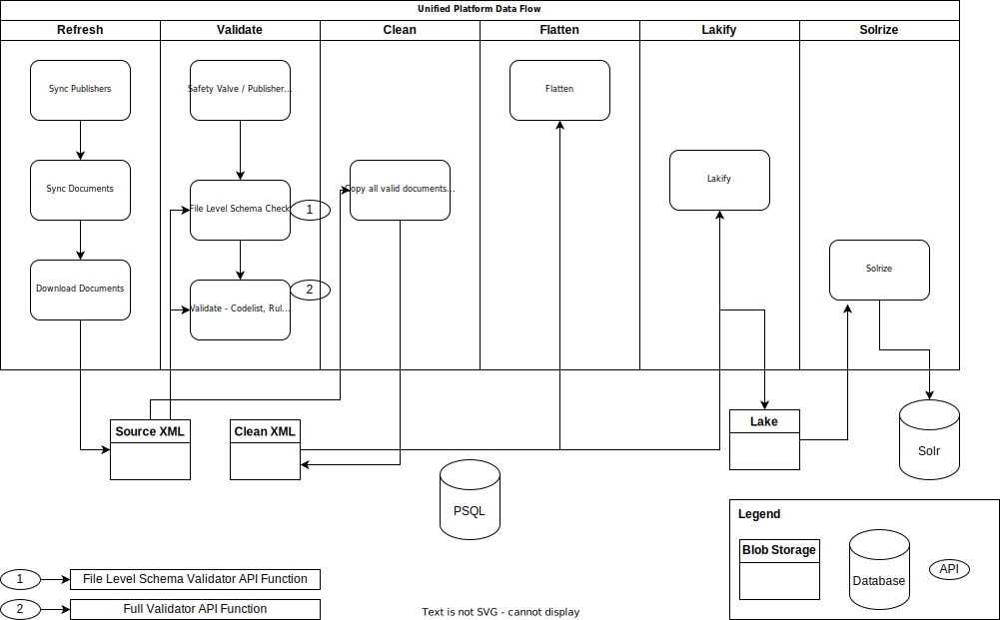

# IATI Refresher

# Summary

 Product  |  IATI Refresher
--- | ---
Description | A Python application which has the responsibility of tracking IATI data from around the Web and refreshing the core IATI software's data stores.
Website |  None
Related | [datastore-search](https://github.com/IATI/datastore-search), [validator-web](https://github.com/IATI/validator-web)
Documentation | Rest of readme
Technical Issues | See https://github.com/IATI/refresher/issues
Support | https://iatistandard.org/en/guidance/get-support/


Its responsibilities include:

- Downloads IATI data as presented by the IATI registry
- Store and track changes in the source files
- Validate the source files using the IATI Validator API
- Store and index the normalised data in a compressed and performant Postgresql database.
- Flattens and Lakifies the IATI data into documents which are then added to Solr.

# DB Migrations

For alterations and additions to the database schema, migration files are used. These can be found at https://github.com/IATI/refresher/tree/integrateValidator/src/migrations

Each migration file should have an `upgrade` and a `downgrade` variable, containing the sql required to either upgrade to, or downgrade from, that version. A simple example might be:

```
upgrade = """ALTER TABLE public.refresher
    ADD COLUMN valid boolean;"""

downgrade = """ALTER TABLE public.refresher
    DROP COLUMN valid;"""
```

Before running any task, the Refresher checks the version of the database against the version number found at https://github.com/IATI/refresher/blob/integrateValidator/src/constants/version.py. The `__version__` variable in that file is an object with the version number and the corresponding DB migration number. Of course, not every version will require a DB change, but if it does the Refresher will migrate the database either up or down to match the versions, running each step as it goes. So, an upgrade from migration 2 to 4 will run the `upgrade` sql from migration 3 and then 4. A downgrade from 4 to 2 will run the `downgrade` sql from migration 4 and then 3.

# Local Setup

## Prerequisities

- Python 3
- PostgreSQL (version 11)

## Create Local Database

- Creates a database called `refresher` owned by `refresh`
   `createdb refresher -O refresh`

## launch.json

Setup a `.vscode/launch.json` to run locally with attached debugging like so:

```json
{
  "configurations": [
    {
      "name": "Refresh - Local",
      "type": "python",
      "request": "launch",
      "program": "${workspaceFolder}/src/handler.py",
      "console": "integratedTerminal",
      "args": ["-t", "refresh"],
      "env": {
        "AZURE_STORAGE_CONNECTION_STRING": "",
        "AZURE_STORAGE_CONTAINER_SOURCE": "",
        "SOLR_API_URL": "http://localhost:8983/solr/",
        "DB_USER": "refresh",
        "DB_PASS": "",
        "DB_HOST": "localhost",
        "DB_NAME": "refresher",
        "DB_PORT": "5432",
        "DB_SSL_MODE": "disable",
        "PARALLEL_PROCESSES": "10"
      }
    }
```

## Environment Variables

The canonical source for environment variables and constants is `src/constants/config.py`.

To get started with local development, copy `.env-example` to `.env` and fill in as needed. As a minimum, you'll need to set up the database details. 

If you want to run the validate stage, you'll need to configure `SCHEMA_VALIDATION_*` variables and `VALIDATION_*` variables. It is generally safe to use the dev server to do the validation.

If you want to test the Solrize code, you'll need to run a local Solr instance - it is **not** safe to use the Solr dev server.

### Limiting the reporting orgs (publishers) and datasets processed during development

During local development, it is often desirable to limit the datasets which are processed. Three environment variables are available for this purpose.

`LIMIT_ENABLED`

Turn on limited processing. Should be 'yes' or 'no'. Default is 'no'.

`LIMIT_TO_REPORTING_ORGS`

A CSV list of reporting orgs (publishers) that should be included in the update. It is the `short_name`s of the reporting orgs (publishers), and not their UUIDs.

Example:

```
LIMIT_TO_REPORTING_ORGS="wfp,who,worldbank,sida,onl,3fi,fifty_eight,aasaman,aw"
```

`LIMIT_TO_DATASETS`

A CSV list of datasets that should be included in the processing. Note that you must include the reporting org that publishes the dataset in the list of reporting orgs above.

Example:

```
LIMIT_TO_DATASETS="3fi-activities,fifty_eight-et,onl-activity,aw-jo,sida-102"
```


### AZURE_STORAGE_CONNECTION_STRING

- This can be found in the Azure Portal > Storage Account > Access Keys or by running `az storage account show-connection-string -g MyResourceGroup -n MyStorageAccount`

### DB\_\*

Example for connecting to local db you made above:

- "DB_USER": "refresh",
- "DB_PASS": "",
- "DB_HOST": "localhost",
- "DB_NAME": "refresher",
- "DB_PORT": "5432",
- "DB_SSL_MODE": "disable" - leaving blank with default to "require"

# Services

There are 6 services that each are designed to run in a single Docker container:

- refresher
- validate
- clean
- flatten
- lakify
- solrize

Some of these services have more than one task that they perform. Those tasks will each have an entrypoint for testing in `src/handler.py`. All the services have a `<service_name>loop` entrypoint that runs the service's tasks continuously in a loop. These service loop entrypoints are used in the deployed containers as start commands.

## Data Flow Diagram



# Refresh

## Functions

- `refresh_publisher_and_dataset_info()` - Syncs the list of IATI Publishers and Documents from the [IATI Bulk Data Service](https://bulk-data.iatistandard.org/) API to the Database.
- `reload()` - Downloads source IATI XML from URLs as defined in the registry to blob storage.

## Logic

Service Loop (when container starts)

- `refresh_publisher_and_dataset_info()`
  - `get_dataset_list()` and `get_reporting_orgs_supplemented_metadata()` 
    - fetches the (minimal) dataset index and the reporting org index from the Bulk Data Service
    - if these files are not from the same run of the Bulk Data Service, the update is skipped.
  - `sync_publishers()` 
    - checks the number of publishers hasn't reduced below the safety threshold (if it has, throws exception)
    - updates database with the latest list of publishers, updating their last seen time (table: publisher)
    - removes any publishers where `document.last_seen` is from a previous run (so no longer in Bulk Data Service)
  - `sync_documents()` 
    - checks the number of datasets hasn't reduced below the safety threshold (if it has, throws exception)
    - compiles list of `changed_datasets` (i.e., where `document.id` is same, but `document.hash` has changed)
    - updates database with latest dataset metadata from the Bulk Data Service (table: document)
      - If there is a conflict with `document.id`, `hash,url,modified,downloaded,download_error` are updated along with `validation_*`, `lakify_*`, `flatten_*`, `clean_*` and `solrize_*` columns being cleared
    - Checks for `stale_datasets` - `document.last_seen` is from a previous run (so no longer in registry)
    - `clean_datasets()`
      - Removes `stale_datasets` from Activity lake, decided it wasn't worth updating `changed_datasets` from activity lake because filenames are hash of `iati_identifier` so less likely to change.
      - Removes `stale_datasets` from source and clean xml blob container and Solr.
      - Removes `changed_datasets`from source and clean xml blob container. Not Solr as this will be removed later, and we want the older data to be available to data store users during processing.
    - Removes `stale_datasets` from DB documents table
- `reload(retry_errors)`
  - `retry_errors` is True after RETRY_ERRORS_AFTER_LOOP refreshes.
  - Gets documents to download from DB (db.getRefreshDataset)
    - If `retry_errors=true` - `"SELECT id, hash, url FROM document WHERE downloaded is null AND (download_error != 3 OR download_error is null)"`
    - Else - `"SELECT id, hash, url FROM document WHERE downloaded is null AND download_error is null"`
  - Downloads docs from Bulk Data Service, saves to Blob storage, updates DB
    - `download_chunk()`
      - If successfully uploaded to Blob - `db.updateFileAsDownloaded`
        `"UPDATE document SET downloaded = %(dt)s, download_error = null WHERE id = %(id)s"`
      - If error occurs `db.updateFileAsDownloadError`
        - Dataset has non-200 response as reported by Bulk Data Service - `document.download_error` = status code (from Bulk Data Service index)
        - Connection Error (to BDS Azure cache) `document.download_error = 0`
        - SSL Issue (to BDS Azure cache) `document.download_error = 1`
        - Charset detection issue (for downloaded content) `document.download_error = 2`
        - ~~Not HTTP URL (e.g. FTP) `document.download_error = 3` - these are NOT re-tried~~
        - `url` is null, as Bulk Data Service could not download `document.download_error = 4`
      - If `AzureExceptions.ServiceResponseError` or other Exception
        - Warning logged, DB not updated

# Validate

## Functions

- `safety_check()` - Handles publisher flagging workflow to prevent wasting resources validating 100's of critically invalid documents.
- `validate()` - Validates IATI XML by sending them to the [Validator API](https://github.com/iati/js-validator-api) and then saving the resulting reports in the Database

## Logic

- `safety_check()`

  - Checks Azure storage queue to see if there are any requests to remove black flag from a publisher, then removes if so
  - Runs database query `db.blackFlagDubiousPublishers()` to see if any publishers have published `SAFETY_CHECK_THRESHOLD` number of critically invalid documents in `SAFETY_CHECK_PERIOD` hours, then marks them with a `publisher.black_flag` timestamp in the database
  - Sends a notification to the Slack App using the `[POST] /pvt/notification/slack` endpoint of [IATI/communications-hub](https://github.com/IATI/communications-hub) for newly flagged publishers and updates DB as such.

- `validate()`
  - Gets unvalidated documents `db.getUnvalidatedDatasets`
  - `process_hash_list()`
    - Loops over documents
    - If document was previously Schema validated and it's invalid, we wait `SAFETY_CHECK_PERIOD` hours before Fully validating it for the safety check.
    - If document was previously Schema validated and it's invalid and if publisher is flagged, we skip Full validation
    - Downloads doc from Azure blobs
      - If charset undetectable, breaks out of loop for that document
    - POST's to Validator API - Schema Check only first
    - Updates Validation Request Time in db (db.updateValidationRequestDate)
      - `document.validation_request`
    - With response updates `document.file_schema_valid` boolean column
    - If Schema valid, moves on to Full Validation
    - POST's to Validator API - Full Validation
    - If Validator Response status code != 200
      - `400, 413, 422`
        - Log status_code in db (db.updateValidationError)
        - Since "expected" and we move on to save report into db
      - `400 - 499`
        - Log status_code in db, break out of loop
      - `> 500`
        - Log status_code in db, break out of loop
      - `else`
        - warning logged, nothing in db, we continue on
    - If exception
      - Can't download BLOB, then `"UPDATE document SET downloaded = null WHERE id = %(id)s"`, to force re-download
      - Other Exception, log message, no change to DB
    - Save report into DB (db.updateValidationState)
      - If `state` is None (bad report) `"UPDATE document SET validation=null WHERE hash=%s"`
      - If ok, save report into `validation` table, set `document.validation = hash` and `document.regenerate_validation_report = False`

# Clean

## Functions

- `copy_valid()` - Copies fully schema valid activities documents XML from the "source" container storage to the "clean" container storage which is used as the source for the flatten/lakify containers.
- `clean_invalid()` - Finds schema invalid documents that have valid activities and removes the invalid activities then saves to "clean" container storage

## Logic

- `copy_valid()`
  - Query DB for schema valid activities documents
  - Uses Azure Blobs SDK to copy from `SOURCE_CONTAINER_NAME` "source" to `CLEAN_CONTAINER_NAME` "clean" container in the blob storage account
- `clean_invalid()`
  - Query DB for schema invalid activities documents that have valid activities inside them
  - Downloads source XML for the document
  - Strips out the invalid activities in the document using the validation report metadata `meta=true` on valid/invalid activities
  - Saves the cleaned XML document in the "clean" container

# Flatten

## Functions

- `main()` - Flattens XML into a flat JSON document, then stores it in the database (`document.flattened_activities`) in JSONB format.

Used to use the [iati-flattener service](https://github.com/IATI/iati-flattener),  but now it does it using a Python class it the same process.

## Logic

- `main()`
  - Reset unfinished and errored flattens
  - Get unflattened (`db.getUnflattenedDatasets`)
  - process_hash_list()
    - Start flatten in db (db.startFlatten)
    - Download source XML from Azure blobs - If charset error, breaks out of loop for file
      - Uses Python class `Flattener` to flatten.
      - Mark done and store results in DB (db.completeFlatten)
      - If exception
        - Can't download BLOB, then `"UPDATE document SET downloaded = null WHERE id = %(id)s"`, to force re-download
        - Other Exception, log message, `UPDATE document SET flatten_api_error = %(error)s WHERE id = %(doc_id)s`

# Lakify

## Functions

- `main()` - Takes XML activities documents from the "clean" container, splits them into single activities XML/JSON and saves the individual activities in the "activity-lake" container

## Logic

service_loop() calls main(), then sleeps for 60 seconds

- main()
  - Reset unfinished lakifies
  - Get unlakified documents
  - process_hash_list()
    - If prior_error = 422, 400, 413, break out of loop for this file
    - Start lakify in DB
    - Download "clean" XML from Azure blobs
    - Breaks into individual activities `<iati-activity>`
    - If there is an activity, create hash of iati-identifier and set that as filename
    - Save that file to Azure Blobs activity lake
    - If Exception
      - `etree.XMLSyntaxError, etree.SerialisationError`
        - Log warning, log error to DB
      - Other Exception
        - Log error, log error to DB
    - Also converts the activity XML to JSON and saves in activity lake
    - complete lakify in db (db.completeLakify)

# Solrize

## Functions

- `main()` - Indexes documents into Solr database in 3 collections: activity, budget, and transactions. Where the budget/transactions are "exploded" so that there is one budget/transaction per document in Solr.

## Logic

- service_loop()
  - Get unsolrized documents
  - process_hash_list()
    - For each document, get Flattened activities (db.getFlattenedActivitiesForDoc)
    - If flattened activities are present, continue, otherwise break out of loop for that document
    - Initialise and test connection to the Solr collections
    - Update solr start (db.updateSolrizeStartDate)
    - Removes documents from Solr for the `document.id` to start fresh
    - Download each activity from the lake
    - Add `iati_xml` field to flattened activity, index to `activity` collection
    - Remove `iati_xml` field, index to exploded collections (budget, transaction)
    - Update db that solrizing is complete for that hash (db.completeSolrize)

# Development

## Code formatters and linters

The following code formatters and linters are installed: `isort`, `flake8`,
`black`, and `mypy`. They can be run with the following commands:

```bash
isort .

black src

flake8 src

mypy
```

These were installed July 2024. Not all the issues flagged by `flake8` and
`mypy` have been addressed yet. If possible, address those issues pertaining to
any code you work on. Similarly, `mypy` type hints have not been added to the
existing code, but should be introduced when refactoring or adding new features.

## Automated tests

Automated testing is done with `pytest`.

There are some unit tests, and there is the beginnings of a framework setup for integration testing.

At present, only the unit tests are run as part of the Github Actions setup.

To run just the unit tests, install the dev dependencies, then run:

```bash
pytest src/tests/unit
```

To run the all the tests, first start the docker compose test environment:

```bash
cd src/tests/integration/test-environment
./start-test-environment.sh
```

The `start-test-environment.sh` script starts docker compose, creates the relevant Azurite blob storage containers, then re-attaches the console to the docker output.

Then you can run all the tests:

```bash
pytest
```

Once you've installed the dev dependencies, the tool `pytest-watcher` will also be available. This tool automatically re-runs the test suite every time you save one of the source files. You can run it with:

```bash
pytest-watcher .
```


# Deployment

The Docker container is built containing all of the Python code. Then 6 individual containers are run using the different entry point loops.

We've deployed this to Azure Container Instances using GitHub Actions and the Azure/CLI Action.

The `az container create` command is used with a deployment YAML `deployment/deployment.yml`. Specification [here](https://learn.microsoft.com/en-us/azure/container-instances/container-instances-reference-yaml)

We use `sed` in the GitHub Actions workflow to replace the variable #PLACEHOLDERS# in the deployment YAML template. Note that any variables with a `^` might have issues with the `sed` command since we are using `^` as the delimiter in the `sed` command.
